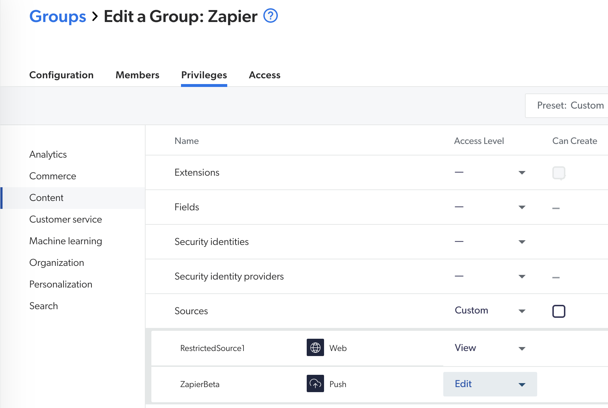
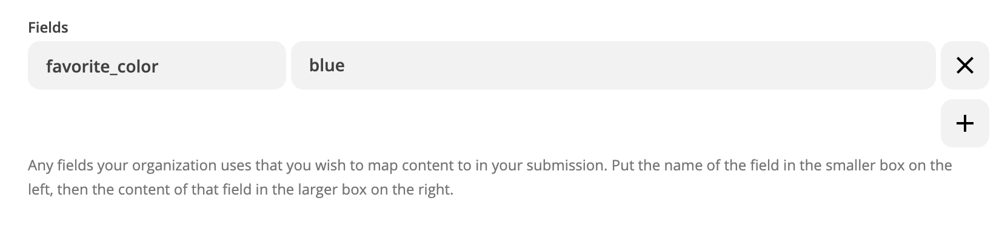
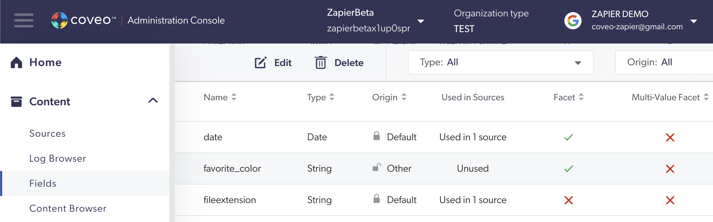

## Does the Coveo Account Need Any Special Account Permissions?

User need the ___Edit___ permission on at least one Push source.

For more information, see the Coveo documentation on [Required Privileges](http://www.coveo.com/go?dest=cloudhelp&lcid=9&context=256#privileges)
and [Push API Usage Overview](https://docs.coveo.com/en/50/cloud-v2-developers/push-api-usage-overview).

## What Constitutes a Valid Document IDs

Items in a Coveo index are uniquely identified by a _documentId_. Coveo expects these IDs to be in URI format. The URI does not need to map to a real resource; any _name_://_path_ is valid.

For example, the following URIs are valid for _documentId_:
* `gmail://12345`
* `https://zapier.com`
* `https://zapier.com/help/coveo`
* `discuss://category1/topic2/post3`

The following URIs are invalid for _documentId_, meaning that the items will be rejected:
* `/a/b/c`
* `gmail:12345`
* `gmail/12345`
* `zapier.com/help/coveo`

## Understanding Delays and Responses from Push and Delete

When pushing and deleting documents, you get a successful response (`202`) when the document is successfully added to the pipeline queue.

In other words, pushing invalid data (like with a invalid _documentId_) may yield a successful response. However, the item will later be rejected when it is processed by the queue. You can see these errors in the Coveo Log Browser (see [Log Browser](
http://www.coveo.com/go?dest=cloudhelp&lcid=9&context=340)).

Deleting a document using a _documentId_ that does not exist will also yield a successful response, because the call was successfully added to the queue. The error will be raised only when it is actually processed.

## I Cannot See My Values for My Fields in the Index

When using custom fields with the __Push or Update Content__ action, you need to ensure the fields exist in your Coveo index. Otherwise, your custom fields will simply be ignored.

## Validating Push Action with the Content Browser

You can use the Coveo [Content Browser](
http://www.coveo.com/go?dest=cloudhelp&lcid=9&context=289) and sort by _Indexed date_ to see if you Zap successfully pushed your content.

